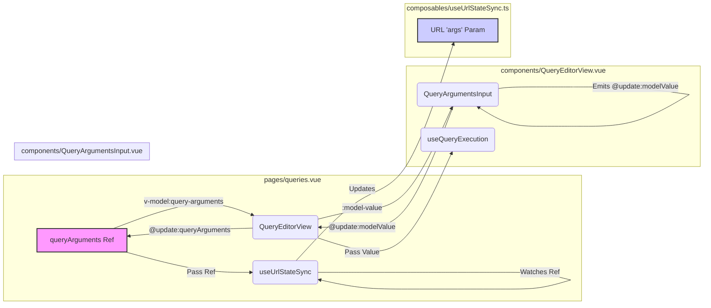

# Query Arguments URL Sync Plan

## Problem Analysis

We traced the state flow for query arguments:

1.  **`pages/queries.vue`**: Owns the primary `queryArguments = ref({})`. Passes it to `useUrlStateSync` and down as a prop `:query-arguments` to `QueryEditorView`.
2.  **`useUrlStateSync.ts`**: Watches the `queryArguments` ref from `pages/queries.vue` and updates the URL when it changes.
3.  **`QueryEditorView.vue`**: Receives `queryArguments` as a prop. **Crucially, it uses `v-model="props.queryArguments"` on the `<QueryArgumentsInput>` component.**
4.  **`QueryArgumentsInput.vue`**: Emits `update:modelValue` when arguments change.

**The Issue:**

The problem lies in `QueryEditorView.vue` using `v-model` directly on a prop (`props.queryArguments`). Props are designed for one-way data flow (parent to child). While mutating an object passed as a prop *might* sometimes appear to work, it violates Vue's intended pattern and often breaks reactivity tracking, especially when external watchers (like the one in `useUrlStateSync`) are involved.

The `v-model` on `props.queryArguments` attempts to directly modify the object owned by the parent (`pages/queries.vue`). This direct mutation doesn't reliably trigger the watcher in `useUrlStateSync` because the *ref itself* in `pages/queries.vue` isn't being explicitly updated through the standard event emission mechanism.

## Proposed Solution

Restore the standard Vue pattern for component communication: props down, events up.

1.  **`QueryEditorView.vue`:**
    *   Stop using `v-model` on the prop for `<QueryArgumentsInput>`. Instead, pass the prop value using `:model-value` and listen for the `@update:modelValue` event.
    *   Define its own emit, `update:queryArguments`.
    *   When `@update:modelValue` is received from `<QueryArgumentsInput>`, emit `update:queryArguments` upwards to the parent (`pages/queries.vue`) with the new arguments object.
    *   Modify methods like `discardChanges` and `prepareNewQueryState` to emit `update:queryArguments` with an empty object `{}` instead of directly mutating the prop/ref.
    *   Adjust how arguments are passed to `useQueryExecution` (likely just passing the prop value or a computed property based on it).

2.  **`pages/queries.vue`:**
    *   Modify the usage of `<QueryEditorView>` to use `v-model:query-arguments="queryArguments"`. This is shorthand for passing the `:query-arguments` prop and listening for the `@update:queryArguments` event to update the local `queryArguments` ref.

## Plan Summary Diagram

This plan ensures the reactivity chain is maintained, allowing `useUrlStateSync` to detect changes in the `queryArguments` ref and update the URL accordingly.
